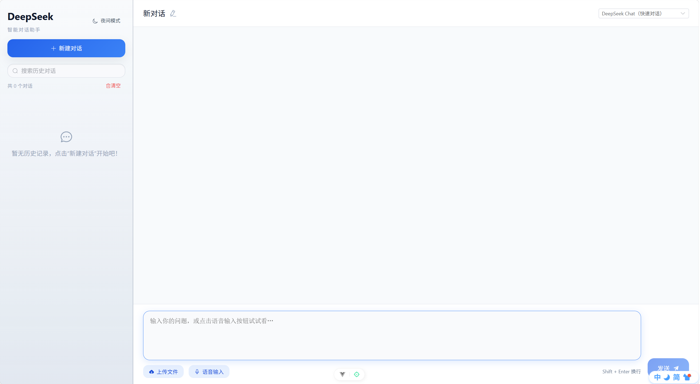

# vue-llm 智能对话前端

Vue-LLM 是一个基于 Vue 3 + Vite 构建的轻量级对话应用前端，提供富文本的聊天体验、会话管理、附件上传以及与大语言模型的串流交互能力。项目经过定制化的 UI 优化，重点关注对话可读性与文件理解能力，适合作为集成自定义大模型服务的基础界面。


## ✨ 主要特性

- **日夜双主题界面**：提供全新的柔和配色体系与日/夜模式切换按钮，侧边栏、消息气泡、输入区等组件均基于 CSS 变量自动适配亮暗主题，并保留 Markdown、代码高亮和表格渲染支持。
- **智能文件附件**：支持上传常见文本文件，同时内置 DOCX 与 PDF 解析流程，自动提取正文预览并附加到对话上下文中。
- **会话管理增强**：新建对话在输入内容或重命名之前不会出现在侧边栏，避免列表膨胀；删除最后一个会话时会自动创建一条新的空白对话。
- **即时串流体验**：通过 `chatStream` 接口实时展示模型输出，采用 requestAnimationFrame + 60ms 节流实现逐字流畅输出；流式期间以纯文本展示避免布局跳动，结束后自动切换为 Markdown 渲染；滚动定位、复制代码块等体验全面优化。
- **双模型一键切换**：在聊天面板中直接选择 DeepSeek Reasoner 或 DeepSeek Chat，自由平衡推理深度与响应速度。
- **持久化存储**：借助 Pinia 与 `pinia-plugin-persistedstate`，会话记录、标题和附件说明都会保存在浏览器本地，刷新不丢失。
- **多端自适应布局**：针对桌面端、平板和移动端提供分级响应式样式，桌面界面保持原样，同时在小屏幕上提供抽屉式会话栏和整屏聊天体验。

## 🗂️ 目录结构

```
vue-llm/
├── public/                 # 静态资源
├── src/
│   ├── apis/               # 与后端或模型服务交互的 API 封装
│   ├── assets/             # 静态资源与全局样式
│   ├── components/
│   │   └── chat/           # 聊天相关的可复用组件
│   ├── stores/             # Pinia 状态管理（会话、推理记录等）
│   ├── utils/              # 工具方法
│   └── views/              # 页面级组件（聊天主界面）
├── package.json            # 项目依赖与脚本
└── vite.config.js          # Vite 配置
```

## 🚀 快速开始

### 环境要求

- Node.js 18+（推荐使用 LTS 版本）
- npm 9+ 或兼容的包管理工具（例如 pnpm、yarn）

### 安装依赖

```bash
npm install
```

安装过程会额外拉取 `jszip` 和 `pdfjs-dist`，用于解析 DOCX 与 PDF 文件。

### 启动开发服务器

```bash
npm run dev
```

默认使用 Vite 启动，可通过 `--host`、`--port` 自行调整绑定地址与端口。

### 生产构建与预览

```bash
# 构建生产包
npm run build

# 本地预览构建产物
npm run preview
```

### 代码质量检查

```bash
npm run lint
```

命令将运行 ESLint，并自动尝试修复可修复的问题。

### 打包发布

```bash
pnpm run package
```

将项目打包为压缩包（tar.gz 与 zip），仅包含必要源码与配置，便于他人下载使用。**会自动排除 `src/config/deepseekKey.js`**，避免泄露密钥；下载者需复制 `deepseekKey.example.js` 为 `deepseekKey.js` 并填入密钥。压缩包输出到项目父目录。

### 配置 DeepSeek API 密钥

1. 访问 [DeepSeek 控制台](https://platform.deepseek.com/) 创建或查看 API Key，确保该密钥具有调用聊天与推理模型的权限。
2. 将 `src/config/deepseekKey.example.js` 复制为 `deepseekKey.js`，并填入你的密钥，例如：
   ```bash
   cp src/config/deepseekKey.example.js src/config/deepseekKey.js
   # 然后编辑 deepseekKey.js，将占位字符串替换为 sk-xxxxxxxxxxxxxxxxxxxx
   ```
3. 出于安全考虑，不要将真实密钥提交到版本库；打包发布时会自动排除 `deepseekKey.js`。

## 💡 功能说明

### 会话列表与标题

- 点击“新建对话”后会生成一条新的空白会话，但在发送首条消息或修改标题前不会显示在侧边栏。
- 如果用户多次点击“新建对话”仍未输入内容，会保持同一个待输入的对话，不会产生多余条目。
- 删除任意对话后，界面会自动切换到最近更新的会话；当删除最后一个会话时，会立即创建一条新的空白对话供继续使用。

### 消息展示

- 用户消息气泡使用高对比度配色，在亮暗主题下都具备良好的可读性。
- 支持 Markdown、表格、代码块与一键复制功能；AI 推理链（如有）可以折叠/展开查看。
- AI 回复新增“复制全文”“重新生成”以及删除按钮，用户与 AI 消息均支持单条删除，操作面板统一收纳在气泡顶部。
- **流式输出**：AI 回复采用逐字流式展示，流式期间以纯文本 + 闪烁光标呈现，避免未闭合 Markdown（如代码块）导致的布局跳动；流结束后自动切换为完整 Markdown 渲染。
- **布局稳定**：消息列表使用普通滚动（非虚拟滚动），配合 `overflow-anchor: auto` 与 `contain: layout`，确保流式输出时页面无明显偏移跳动。
- 自动滚动逻辑根据用户交互智能判断，防止阅读历史消息时被强制滚动到底部。

### 跨端布局优化

- 桌面端沿用左右分栏界面，保证现有使用体验完全不变。
- 平板与移动端自动切换为顶部导航 + 抽屉侧栏布局，可随时展开会话列表并在点击后自动收起。
- 聊天区、输入框和按钮在小屏幕上会自动调整间距与字号，确保触控操作的准确性。

### 主题切换

- 侧边栏右上角新增“日间模式/夜间模式”按钮，一键在亮色与暗色风格之间切换。
- 主题状态会自动持久化，并在初次访问时根据操作系统偏好选择默认模式。
- 全局配色由 CSS 变量驱动，自定义主题或品牌色时可在 `src/assets/base.css` 中集中调整。

### 附件解析

- 支持 `.txt`、`.md`、`.csv`、`.json` 等纯文本文件，自动截取前 8,000 字符作为上下文。
- **DOCX 文件**：通过 `JSZip` 解压并提取 `word/document.xml` 内容，解析段落文本供模型参考。
- **PDF 文件**：利用 `pdfjs-dist` 抽取页面文字，进行去噪与拼接，同样限制在 8,000 字符以内。
- 解析失败或非文本格式的文件，会附带元信息（名称、大小、类型）与提示说明，方便人工甄别。

## 🛠️ 配置与扩展

- `src/apis/deepseek.js` 中封装了与大模型服务交互的流式请求逻辑，使用 axios `onDownloadProgress` 解析 SSE；可根据后端实际接口进行调整。
- `src/config/deepseekKey.js` 保存 DeepSeek API 密钥的占位符，可结合部署策略改为读取环境变量或后端代理。
- `src/stores/session.js` 负责管理会话、推理链、显示状态等数据。若需扩展会话属性（如标签、置顶），可在该文件集中修改。
- 样式主要使用 `<style scoped>` + CSS，若希望统一主题，可在 `src/assets` 中引入全局样式或 Tailwind 等工具。

## 📦 部署建议

1. 使用 `npm run build` 产出静态资源后，通过任意静态服务器（Nginx、Vercel、Netlify 等）托管。
2. 若后端接口与前端不在同一域名，请注意配置反向代理或在 Vite 中设置 `server.proxy` 以避免跨域问题。
3. 如需 HTTPS 或自定义域名，建议使用 CDN/负载均衡配合证书统一管理。

## 🤝 参与贡献

欢迎提交 Issue 与 Pull Request！建议在提交前运行 `npm run lint`，并附带功能说明或截图，方便维护者快速 Review。

---

如在使用过程中遇到问题，欢迎反馈与讨论，让 Vue-LLM 变得更好用。
