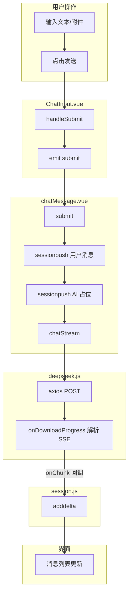
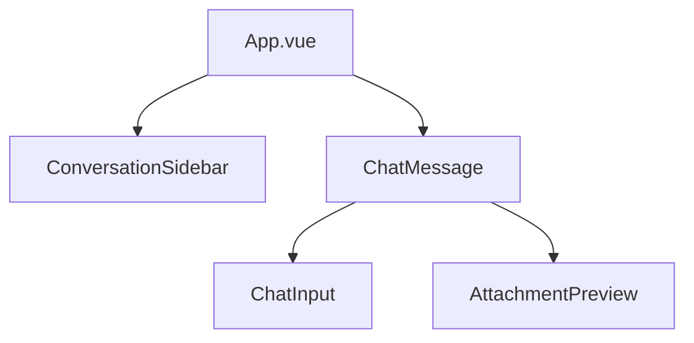

# Vue-LLM 项目架构文档

本文档面向未接触过本项目的开发者，详细介绍目录结构、各文件职责、AI 对话实现原理及功能模块。阅读后可快速理解代码并上手修改。

## 快速导航

- [项目概览](#1-项目概览) — 技术栈与核心能力
- [目录结构详解](#2-目录结构详解) — 每个文件在做什么
- [AI 项目搭建流程](#3-ai-项目搭建流程新手视角) — 从零到跑通的完整链路
- [数据流与组件关系](#4-数据流与组件关系) — 组件树与事件传递
- [功能实现详解](#5-功能实现详解) — 流式输出、附件、语音等
- [API 调用链](#6-api-调用链) — chatStream 与 SSE 解析
- [关键依赖说明](#7-关键依赖说明) — 各依赖的用途
- [常见问题与排查](#8-常见问题与排查)
- [扩展建议](#9-扩展建议)

---

## 1. 项目概览

### 技术栈

| 技术 | 用途 |
|------|------|
| Vue 3 | 前端框架，使用 Composition API |
| Vite | 构建工具，提供快速开发与打包 |
| Pinia | 状态管理（会话、消息、主题等） |
| pinia-plugin-persistedstate | 持久化插件，刷新后保留会话与主题 |
| Element Plus | UI 组件库（按钮、输入框、弹窗等） |
| axios | HTTP 请求，用于调用 DeepSeek API |
| markdown-it | Markdown 渲染 |
| highlight.js | 代码高亮 |
| jszip | DOCX 文件解析 |
| pdfjs-dist | PDF 文件解析 |

### 核心能力

- **流式对话**：AI 回复逐字展示，支持 DeepSeek Reasoner / Chat 双模型
- **多模态输入**：文本、语音识别、文件上传（TXT / PDF / DOCX / 代码等）
- **会话管理**：新建、删除、重命名、切换会话，数据持久化
- **主题切换**：日间 / 夜间模式，跟随系统偏好

### 一句话链路

用户输入 → `ChatInput` 发送 → `chatMessage.submit` → `chatStream` 调用 DeepSeek API → SSE 流式返回 → `onDelta` 累积 → `adddelta` 写入 store → 界面逐字展示

---

## 2. 目录结构详解

```
vue-llm-copy/
├── index.html              # 入口 HTML，挂载 #app
├── package.json            # 依赖与脚本（dev/build/lint/package）
├── vite.config.js          # Vite 配置：Vue 插件、路径别名 @、自动导入
├── pnpm-lock.yaml          # 依赖锁文件
├── README.md               # 项目说明
├── docs/
│   ├── RESUME_GUIDE.md     # 简历包装说明
│   └── ARCHITECTURE.md     # 本架构文档
├── scripts/
│   └── package-release.sh  # 打包脚本，生成 tar.gz / zip 便于分发
├── public/
│   └── favicon.ico         # 网站图标
└── src/
    ├── main.js             # 应用入口
    ├── App.vue             # 根组件
    ├── config/
    │   ├── deepseekKey.js      # API 密钥（不纳入打包，需自行创建）
    │   └── deepseekKey.example.js  # 密钥模板，复制为 deepseekKey.js 后填入
    ├── apis/
    │   └── deepseek.js     # chatStream、abortStream
    ├── stores/
    │   ├── session.js      # 会话、消息、推理链
    │   └── theme.js        # 日/夜主题
    ├── utils/
    │   └── MarkdownWorker.js  # Web Worker 封装（当前未使用）
    ├── assets/
    │   ├── base.css        # 主题 CSS 变量
    │   ├── main.css        # 全局样式
    │   ├── avatars/        # 用户/AI 头像
    │   └── logo.svg
    ├── views/
    │   └── chatMessage.vue # 聊天主视图
    └── components/chat/
        ├── ChatInput.vue         # 输入框、附件、语音
        ├── AttachmentPreview.vue # 消息内附件展示
        └── ConversationSidebar.vue # 侧边栏
```

### 关键文件核心方法/状态

**`src/stores/session.js`**

| 状态/方法 | 说明 |
|-----------|------|
| `session` | 按会话名存储消息数组，结构为 `{ "会话名": [{ role, content, attachments }] }` |
| `curname` | 当前选中的会话名 |
| `reason` | 推理链内容（Reasoner 模型） |
| `model` | 当前模型（deepseek-reasoner / deepseek-chat） |
| `sessionpush(msg)` | 向当前会话追加一条消息 |
| `adddelta(delta)` | 将流式增量追加到最后一条 assistant 消息 |
| `getMessagesForModel()` | 构造 API 请求体，含附件描述 |
| `selecthistory(name)` | 切换当前会话 |
| `getcurmsgs()` | 获取当前会话消息列表，带 `_key` 供列表渲染 |

**`src/apis/deepseek.js`**

| 方法 | 说明 |
|------|------|
| `chatStream(messages, onChunk, onDone, onReasoning, model)` | 发起流式请求，通过回调推送增量 |
| `abortStream()` | 中止当前请求（点击「停止」时调用） |

**`src/views/chatMessage.vue`**

| 状态/方法 | 说明 |
|-----------|------|
| `msg` | 输入框内容（v-model 绑定 ChatInput） |
| `isTyping` | 是否正在生成回复 |
| `messages` | 当前会话消息列表（computed 自 sessionStore） |
| `submit({ attachments })` | 发送消息并发起流式请求（约第 255–298 行） |
| `onDelta(delta)` | 接收流式增量，缓冲后写入 store |
| `flushBuffer()` | 将缓冲内容写入 store 并滚动到底部 |
| `renderMarkdown(raw)` | 将 Markdown 转为 HTML |
| `isStreamingMessage(item, index)` | 判断是否为正在流式输出的最后一条 assistant 消息 |

---

## 3. AI 项目搭建流程（新手视角）

### 3.1 环境准备

1. 安装 Node.js 18+ 与 pnpm（或 npm）
2. 将 `src/config/deepseekKey.example.js` 复制为 `deepseekKey.js` 并填入 API 密钥
3. 执行 `pnpm install` 安装依赖
4. 执行 `pnpm dev` 启动开发服务器

### 3.2 应用启动链路

```
main.js
  → createApp(App)
  → pinia.use(piniaPluginPersistedstate)   # 持久化
  → themeStore.initialize()                 # 主题初始化
  → app.mount("#app")
```

`App.vue` 负责整体布局：左侧 `ConversationSidebar`，右侧 `ChatMessage`。移动端（≤1024px）侧边栏变为抽屉，顶部显示当前会话标题。

### 3.3 首次对话流程



1. 用户输入并点击发送 → `ChatInput.handleSubmit` 触发 `emit('submit', { attachments })`
2. `chatMessage.submit` 接收：先 `sessionpush` 用户消息，再 `sessionpush` 一条空的 AI 消息
3. 调用 `chatStream`，传入 `getMessagesForModel()` 的返回值（不含最后一条 AI 占位）
4. 服务端 SSE 流式返回 → `onDownloadProgress` 解析 → `onChunk` 回调推送增量
5. `onDelta` 累积增量，经 `requestAnimationFrame` + 60ms 节流后 `flushBuffer` → `adddelta` 写入 store
6. `messages` 为 computed，store 更新后自动触发视图更新，实现逐字展示

---

## 4. 数据流与组件关系

### 4.1 组件树



### 4.2 Store 与组件

| Store | 消费位置 |
|-------|----------|
| sessionStore | ChatMessage、ConversationSidebar、ChatInput（通过 isTyping） |
| themeStore | App、ConversationSidebar |

### 4.3 事件流

| 事件 | 触发方 | 接收方 | 作用 |
|------|--------|--------|------|
| `@submit` | ChatInput | ChatMessage | 发送消息 |
| `@callR` | ConversationSidebar | App | 选择会话 |
| `selecthistory(name)` | App | ChatMessage（通过 ref） | 切换会话并刷新消息 |

`App.vue` 通过 `chatPanelRef` 持有 ChatMessage 的引用，侧边栏点击会话时调用 `chatPanelRef.selecthistory(name)`，进而调用 `sessionStore.selecthistory(name)`，`curname` 变更后 `messages` 自动更新。

---

## 5. 功能实现详解

### 5.1 流式输出

**做什么**：AI 回复逐字展示，而非整段一次性返回。

**在哪实现**：`src/apis/deepseek.js`、`src/views/chatMessage.vue`

**原理**：

1. **API 层**：请求时设置 `stream: true`，服务端返回 SSE（Server-Sent Events）流。每条数据形如 `data: {"choices":[{"delta":{"content":"你"}}]}\n`。
2. **解析**：axios 的 `onDownloadProgress` 可拿到累积的响应文本。按行分割，过滤 `data: ` 开头的行，`JSON.parse` 提取 `delta.content`，通过 `onChunk` 回调传给视图层。
3. **节流**：`onDelta` 将增量累加到 `pendingDeltas`，用 `requestAnimationFrame` + 60ms 最小间隔调用 `flushBuffer`，避免每收到一个 token 就更新 DOM。
4. **写入**：`flushBuffer` 调用 `sessionStore.adddelta(pendingDeltas)`，将内容追加到当前会话最后一条 assistant 消息的 `content`。

**关键代码**（chatMessage.vue 第 188–207 行）：

```javascript
const onDelta = (delta) => {
  pendingDeltas.value += delta;
  if (!rafId) {
    const tick = () => {
      const now = performance.now();
      if (pendingDeltas.value && (now - lastFlushTime >= MIN_FLUSH_INTERVAL || lastFlushTime === 0)) {
        flushBuffer();
        rafId = null;
      } else if (pendingDeltas.value) {
        rafId = requestAnimationFrame(tick);
      } else {
        rafId = null;
      }
    };
    rafId = requestAnimationFrame(tick);
  }
};
```

### 5.2 逐字展示与布局稳定

**做什么**：流式期间避免未闭合的 Markdown（如代码块）导致布局跳动。

**在哪实现**：`src/views/chatMessage.vue`

**原理**：

- 通过 `isStreamingMessage(item, index)` 判断：当前为最后一条 assistant 消息且 `isTyping` 为 true。
- 流式时用纯文本 + 闪烁光标 `▌` 展示，不调用 `markdown-it`。
- 流结束后切换为 `v-html="renderMarkdown(item.content)"` 正常渲染。
- 容器使用 `overflow-anchor: auto`、`contain: layout`，消息体设置 `min-height: 1.5em`，减少布局跳动。

### 5.3 Markdown 渲染

**做什么**：将 AI 回复中的 Markdown 转为富文本，支持代码高亮、表格等。

**在哪实现**：`src/views/chatMessage.vue` 第 77–92 行

**原理**：

- 使用 `markdown-it` 配置 `highlight` 回调，内部用 `highlight.js` 高亮代码。
- 通过 `markdown-it-table` 插件支持表格。
- `addCopyButtons` 在 `onMounted` 和 `onUpdated` 时为每个 `<pre>` 添加「复制」按钮。

### 5.4 附件上传与解析

**做什么**：支持上传 TXT、PDF、DOCX、代码等文件，将内容拼进模型上下文。

**在哪实现**：`src/components/chat/ChatInput.vue`、`src/stores/session.js`

**原理**：

1. **上传**：`handleFileChange` 读取文件，根据类型调用 `readFileContent`。
2. **解析**：
   - 纯文本：`FileReader.readAsText`，最多 8000 字符。
   - DOCX：JSZip 解压 `word/document.xml`，提取段落文本。
   - PDF：`pdfjs-dist` 逐页提取文本。
3. **存储**：`attachments` 数组，每项为 `{ id, name, size, type, body, note }`。
4. **发送**：`getMessagesForModel` 中通过 `describeAttachment` 将附件描述拼到 `content`，格式如 `附件:\n文件名: xxx | 大小: 1KB\n内容预览:\n...`。
5. **展示**：`AttachmentPreview` 在消息气泡内展示附件名称、大小等。

### 5.5 语音输入

**做什么**：通过浏览器语音识别将语音转为文字并填入输入框。

**在哪实现**：`src/components/chat/ChatInput.vue`

**原理**：

- 使用 `webkitSpeechRecognition` 或 `SpeechRecognition`。
- `ensureRecognition` 初始化，`startRecording` / `stopRecording` 控制录音。
- `onresult` 中：`isFinal` 的文本追加到 `inputText`，临时结果显示在 `speechPreview`。
- 当 `isTyping` 为 true 时禁用语音，开始生成时自动停止录音。

### 5.6 主题切换

**做什么**：日间 / 夜间模式切换，并持久化。

**在哪实现**：`src/stores/theme.js`、`src/assets/base.css`、`src/components/chat/ConversationSidebar.vue`

**原理**：

- `themeStore.mode` 为 `light` 或 `dark`。
- `applyTheme` 设置 `document.documentElement.dataset.theme` 和 `classList.toggle('dark')`。
- `base.css` 中通过 `:root` 与 `:root[data-theme="dark"]` 定义不同 CSS 变量。
- 侧边栏主题按钮调用 `themeStore.toggleMode()`。
- 使用 `persist: true` 持久化到 localStorage。

### 5.7 会话管理

**做什么**：新建、删除、重命名、切换会话，列表持久化。

**在哪实现**：`src/stores/session.js`、`src/components/chat/ConversationSidebar.vue`

**原理**：

- `session` 为 `{ "会话名": [消息数组] }`，`curname` 为当前会话名。
- `newchat` 创建新会话；`deletehistory` 删除；`updateTitle` 重命名；`selecthistory` 切换。
- `visibility` 控制会话是否在侧边栏显示（新建未输入内容的会话不显示）。
- 通过 `pinia-plugin-persistedstate` 持久化。

### 5.8 模型选择

**做什么**：在 DeepSeek Reasoner 与 DeepSeek Chat 之间切换。

**在哪实现**：`src/stores/session.js`、`src/views/chatMessage.vue`

**原理**：

- `sessionStore.model` 存储当前模型值。
- 聊天区域顶部有 `el-select` 绑定 `selectedModel`。
- 调用 `chatStream` 时传入 `selectedModel.value` 作为 `model` 参数。

---

## 6. API 调用链

### 6.1 chatStream 入参与回调

```javascript
chatStream(
  messages,        // 上下文消息数组，格式 [{ role, content }]
  onChunk,        // 每收到 content 增量时调用，参数为字符串
  onDone,         // 流结束时调用
  onReasoning,    // 每收到 reasoning_content 时调用（仅 Reasoner 模型）
  model           // "deepseek-reasoner" 或 "deepseek-chat"
);
```

### 6.2 getMessagesForModel 构造请求体

`session.js` 第 366–384 行：遍历当前会话消息，对每条消息的 `attachments` 调用 `describeAttachment`，将描述拼到 `content` 末尾，返回 `[{ role, content }]` 数组。

### 6.3 SSE 解析逻辑

`deepseek.js` 第 76–122 行：

1. `onDownloadProgress` 拿到累积响应文本。
2. 按 `\n` 分割，过滤 `data: ` 开头的行。
3. 若行为 `data: [DONE]`，调用 `onDone` 并返回。
4. 否则 `JSON.parse(line.slice(6))` 解析 JSON。
5. 若有 `reasoning_content`，通过 `onReasoning` 回调。
6. 若有 `content`，通过 `onChunk` 回调。
7. 使用 `processedContentChunks`、`processedReasonChunks` 避免重复解析（因响应为累积的）。
8. 解析失败时跳过该行，不中断流。

---

## 7. 关键依赖说明

| 依赖 | 用途 | 使用位置 |
|------|------|----------|
| vue | 框架 | 全局 |
| pinia | 状态管理 | main.js、各 store |
| pinia-plugin-persistedstate | 持久化 | main.js |
| element-plus | UI 组件 | 各组件、自动导入 |
| axios | HTTP | apis/deepseek.js |
| markdown-it | Markdown | chatMessage.vue |
| markdown-it-table | 表格 | chatMessage.vue |
| highlight.js | 代码高亮 | chatMessage.vue |
| jszip | DOCX 解压 | ChatInput.vue |
| pdfjs-dist | PDF 解析 | ChatInput.vue |

---

## 8. 常见问题与排查

### API 密钥未配置或无效

- 确认已从 `deepseekKey.example.js` 复制得到 `deepseekKey.js`，且 `DEEPSEEK_API_KEY` 已填写。
- 若仍报错，在 DeepSeek 控制台确认密钥有效且有调用权限。

### 流式输出不完整

- 网络不稳定可能导致 SSE 中断，可查看控制台是否有请求错误。
- 解析失败的行会被跳过，一般不会导致崩溃，但可能丢失少量内容。

### 附件解析失败

- 确认文件格式在 `ALLOWED_EXTENSIONS` / `ALLOWED_MIME_TYPES` 内。
- 单文件不超过 8MB（`MAX_FILE_SIZE`）。
- DOCX/PDF 解析失败时会附带元信息，模型仍可参考文件名等。

### 主题不生效

- 确认 `themeStore.initialize()` 在 `main.js` 中已调用。
- 检查 `base.css` 是否被正确引入（通过 `main.css` 或 `App.vue`）。

---

## 9. 扩展建议

### 接入其他 LLM API

- 在 `src/apis/` 下新增或修改 API 模块，实现与 `chatStream` 类似的接口（messages、onChunk、onDone）。
- 在 `chatMessage.vue` 的 `submit` 中替换 `chatStream` 调用即可。

### 增加新会话属性

- 在 `session.js` 的 `sessionpush` 中扩展消息结构。
- 在 `getMessagesForModel` 中按需拼入新字段。

### 调整流式节流参数

- 修改 `chatMessage.vue` 中的 `MIN_FLUSH_INTERVAL`（当前 60ms），数值越小更新越频繁，但可能增加渲染压力。
